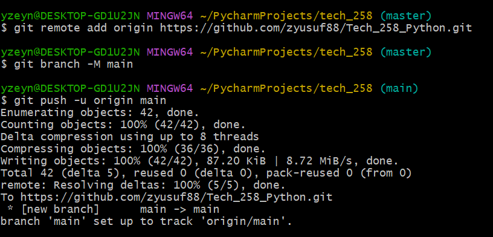
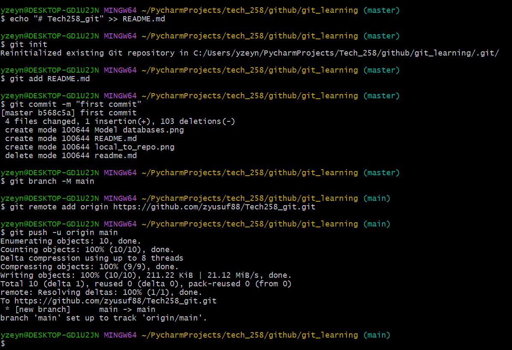

# Version Control
Version control is a system that records changes to files over time, allowing you to recall specific versions later. <br> 
It helps manage collaboration among multiple contributors, track changes, and revert to previous versions if needed.

## Git
 Git is a popular version control system used to track changes in files. It's distributed, meaning every user has a complete copy of the repository, including its full history. <br> 
Git allows collaboration, branching, merging, and facilitates working on different features concurrently.

### git init: 

``` git init: ``` Transform the current directory into a Git repository
``` git init <directory>:``` Transform a directory in the current path into a Git repository


### git status:  
 Show the current status of the repository, including tracked/untracked files and changes.

### git add: 

Add changes in the working directory to the staging area. 
<br>
*You can add specific files by :*
```
git add file1 
```
*Or all files:* 
```
git add .
```

### git commit: 

Record changes staged in the index to the repository.
<br> *Example:*

```
git commit -m "First commit"
```

# git log vs git diff 
The git log command displays committed snapshots. It lets you list the project history, filter it, and search for specific changes. 
<br>


Whereas git diff show changes between commits, commit and working tree, etc.
<br>


# .gitignore

`.gitignore` is a file where you specify intentionally untracked files to be ignored by Git. It helps avoid cluttering the repository with files like compiled binaries, logs, and temporary files. 
<br> Using `.gitignore` ensures that these files are not accidentally committed to the repository, improving its cleanliness and performance.


### Distributed Version Control

Distributed Version Control (DVCS) is a system where each developer has a complete copy of the repository, including its history. This contrasts with centralized systems where there's a single repository. DVCS, like Git and Mercurial, allows developers to work independently, offline if needed, and then sync changes with the central repository or share them directly with others.


- **Centralized Version Control Systems (CVCS)** have a **single central repository** that stores the project's files and history. Developers interact with this central repository to access and update files. 
- **Distributed Version Control Systems (DVCS)** give each developer a complete **copy of the repository**, including its history. Developers work independently, often making changes locally, and then synchronize their work with others' copies of the repository.

### What is GitHub?

- Github allows developers to share code files and collaborate with fellow developers on open-source projects. GitHub also serves as a social networking site where developers can openly network, collaborate, and pitch their work.

- For example: GitLab offers a complete DevOps platform with features like version control, issue tracking, CI/CD pipelines, and more. It's often chosen by organizations looking for a self-hosted solution or an alternative to GitHub's pricing model.


### How do you link a local repo to a remote repo on GitHub? 
 To link a local repository to a remote repository on GitHub, you first need to create a repository on GitHub, copy its URL, and then use Git commands to add it as a remote and push your local changes.
<br>

 ***Below are the steps I took earlier:***
<br>



### Repository to local :

To link a remote repository to a new local one:
1. Initialize a Git repository in your local folder using git init. 
2. Use git remote add origin <repository_URL> to connect the remote repository, replacing <repository_URL> with the URL of the remote repository.

***Below are the step I took to link Repo to local :***
<br>

 

