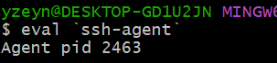
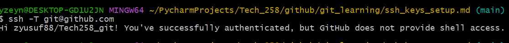
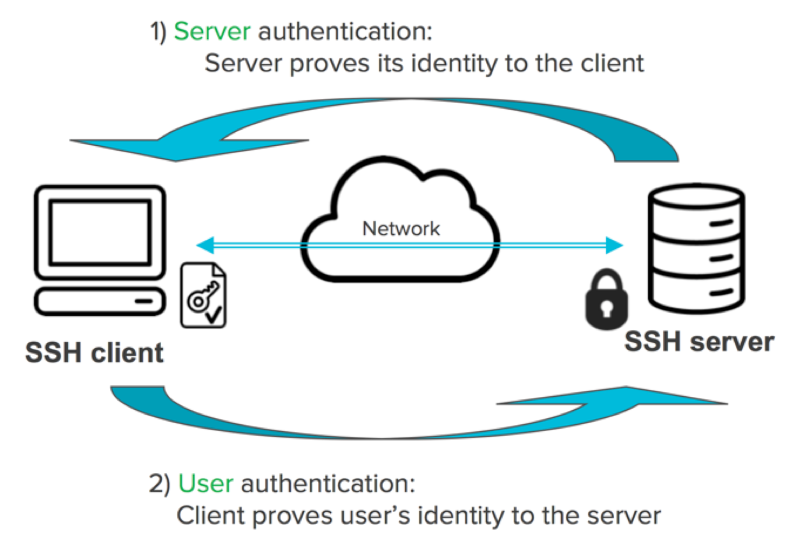

# SSH KEY

A SSH key, or Secure Shell key, is a pair of cryptographic keys used for secure communication between two parties over a network, typically between a client and a server. It consists of a public key and a private key.

- **Public Key:** This key is shared with other parties and is used to encrypt data. It is placed on servers or systems that you want to access securely.

- **Private Key:** This key is kept secret and is used to decrypt data encrypted with the corresponding public key. It is stored on your local computer and should never be shared with anyone.

Below is how I set up a SSH Key to an existing repo:

 ### Generate SSH Key:
- If you haven't already, generate an SSH key pair on your local machine. You can do this by running the following command in your terminal:
```
ssh-keygen -t rsa -b 4096 -C "your_email@example.com"
`````

<br>

**<span style="color: #FFCCCB "> This command will create a new SSH key using the email as a label</span>**

 ### Add the SSH key to your github account:
- Go to the settings of your chosen repository on GitHub. 
- Navigate to the "Deploy keys" section on the left-hand side. 
- Click on "Add deploy key" and paste the contents of your SSH public key.
<br>


### Configure SSH Agent:
- Before adding the new SSH key to the ssh-agent, ensure the ssh-agent is running by executing the following command in your terminal:



 ### Verify SSH Connection:

- Test your SSH connection to GitHub by running the following command in your terminal:




**The new SSH key is now registered and ready to use!**




